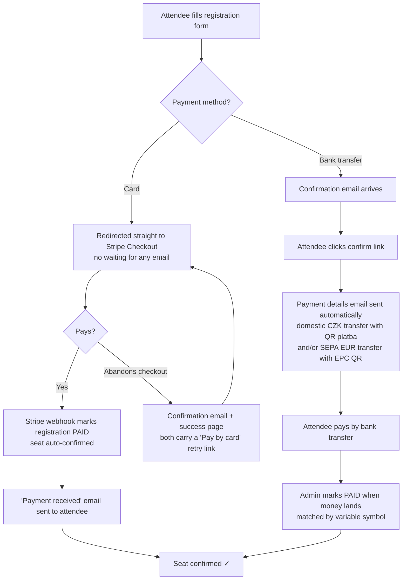

# ANTERIOR — Registration & Payment Flow

**Notes**

- Card payments handled by Stripe — the card never touches our server.
- No middleman and **no service fee** added to the ticket price (unlike the 9 € fee on layered.cz).
- Two offline methods, both set per course in **Manage course → Payment details**: a domestic Czech transfer (account number + CZK amount → QR platba / SPAYD) and a SEPA transfer (IBAN + BIC + EUR amount → EPC QR). Whichever is complete goes into the email, each with its own QR — money goes directly to your account with zero fees. A "Generate QR code" button previews each QR from the current form values before saving.
- Deleting a registration (Registrations list or edit page) asks for a reason and whether to email the participant; the record is archived under **Deleted registrations** and the email address is free to register again.
- If Stripe is ever unavailable, the card option hides itself and bank transfer keeps working.
